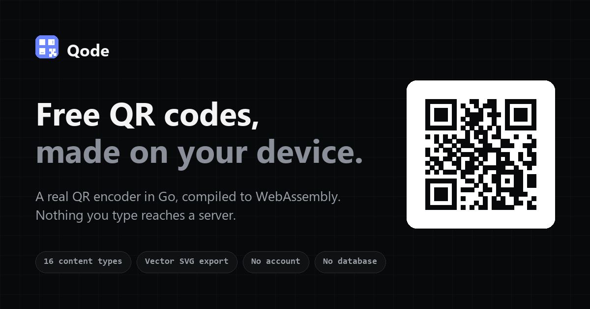
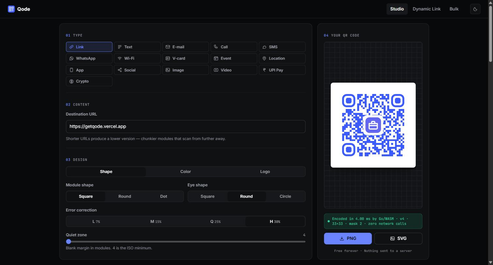

<div align="center">



<br>

**A QR code generator that runs entirely in your browser.**

No account. No database. No subscription. Nothing you type reaches a server.

[**Open Qode →**](https://getqode.vercel.app)

<br>


</div>

---

## Why this exists

Every QR generator asks you to sign up, watermarks your downloads, caps how
many codes you can make, or charges a monthly fee to keep a printed code
working. None of that is technically necessary.

A QR code is an *encoding*. Turning text into a grid of black and white
squares is pure computation — it needs no server, no account and no
storage. Qode does that computation in your browser and nothing else.

The encoder is written from scratch in Go: Reed–Solomon error correction,
all eight mask patterns, versions 1 through 40, byte mode. It compiles to
WebAssembly and ships as a single file.

<div align="center">

</div>

---

## What it does

|  |  |
|---|---|
| **16 content types** | Link · Text · E-mail · Call · SMS · WhatsApp · Wi-Fi · V-card · Event · Location · App · Social · Image · Video · UPI Pay · Crypto |
| **Styling** | Three module shapes, three eye shapes, gradients, colour presets, 16 built-in logos, four logo animations |
| **Export** | True vector SVG, or PNG at 1200 px. No watermark, no limit |
| **Switchable links** | Repoint a printed code at a different URL, instantly, as often as you like |
| **Dynamic links** | Point a code at a page you control and edit the page, not the code |
| **Bulk** | CSV in, ZIP out, no row limit, parsed in the tab |
| **Accessibility** | WCAG AA contrast, full keyboard navigation, reduced-motion support |

Thirteen of the sixteen types are **entirely self-contained** — the payload
*is* the QR content. A phone acts on them with no internet connection, and
they keep working whether or not this site exists.

---

## The interesting parts

### Encoding happens on your device

There is no `POST /api/generate`. The Go encoder runs in your browser via
WebAssembly, so a Wi-Fi password, a private phone number or an unreleased
URL never leaves the machine you typed it on.

The studio shows this as it happens: *"Encoded in 4.00 ms by Go/WASM ·
v4 · 33×33 · mask 2 · zero network calls"*. A server-backed generator
cannot print that line.

### Switchable links: change a printed code's destination

A QR code is ink. Once it is on a poster you cannot edit it — so if the
destination has to change, the code has to point at something that can be
redirected.

```
scan ──► getqode.vercel.app/go/poster ──► lookup ──► wherever you point it today
             └─ this is what gets printed ─┘
```

The **name** is printed and can never change. The **destination** behind it
is one field in `/switch`, and saving takes effect on the next scan — no
rebuild, no redeploy, no reprint.

`/switch` has two tabs, because they are two different jobs. **Generate**
names a code and hands back the QR. **Change** takes the code you already
printed — drop in a photo of the poster — decodes it in the tab, tells you
where that exact piece of paper currently sends people, and lets you aim it
somewhere else. Decoding happens locally via
[jsQR](https://github.com/cozmo/jsQR); the picture is never uploaded.

A scanned code that is not switchable is explained rather than rejected: a
self-contained Qode code, a plain URL, or plain text each say why there is
nothing in between to re-aim.

The lookup is a serverless function against [Turso](https://turso.tech)
(SQLite at the edge, free tier). `/go/<key>` answers with a `302`, never a
`301`, because a permanent redirect gets cached by browsers and proxies —
which would defeat the entire point of being switchable.

Writing is protected by `QODE_ADMIN_TOKEN` and rate limited per IP: five
failed sign-ins per fifteen minutes, thirty saves per hour. Both counters
live in the database rather than in memory, so they survive the cold starts
that serverless functions are made of. Reading is public — these
destinations are printed on posters; they were never secret.

Competitors meter this. Bitly allows five destination changes a month.

### Dynamic links: edit the page, not the code

A different tool for a different problem, and the distinction matters
enough that `/switch` states it before you can get it wrong.

The wizard encodes **your** address directly — a published Notion page, a
Google Doc, your own site. Nothing is wrapped, shortened or routed through
Qode, so these codes scan straight through, stay small, and keep working
whether or not this site exists. What you change afterwards is the *page*;
the code is settled the moment it is printed.

Use switchable when the destination may move. Use dynamic when it will not.

### Encoding still happens on your device

The two features above are the only parts of Qode that touch a server, and
only `/switch` and `/go/<key>` do. Everything else — all sixteen content
types, styling, bulk CSV, export — runs entirely in the tab.

`/r` remains a static page for the App, Social and Gallery types, which
pack their payload into the URL *fragment*:

```
https://getqode.vercel.app/r#s.eyJ0IjoiTXkgTGlua3MiLCJsIjpbLi4uXX0
                             └── your links, base64url ──┘
```

Browsers never transmit a fragment to any server. `/r` reads it out of its
own address bar and decodes it locally, so the server receives a request
for `/r` and nothing more.

Only `http` and `https` are ever followed — in the fragment decoder, in the
`/switch` validator and again in the API. A `javascript:` or `data:`
destination is refused at every one of those three points.

---

## Running it locally

The site itself needs no build tooling. The switchable-link API needs
`npm install` for the Turso client, and a `.env` — copy `.env.example`.

```bash
git clone https://github.com/geekksv/Qode.git
cd Qode
node scripts/build.js
npx serve web          # or: python -m http.server --directory web
```

`scripts/build.js` writes three gitignored files from your environment:
`web/js/config.js`, `web/sitemap.xml` and `web/robots.txt`. Copy
`.env.example` to `.env` first if you want the Image type to work.

### Rebuilding the encoder

Only needed if you change Go source under `cmd/` or `internal/`. The
compiled `web/wasm/main.wasm` is committed so the site deploys as a plain
static bundle.

```bash
./build.sh              # requires Go on PATH
```

### Verifying the encoder

Output is checked module-for-module against a reference implementation,
including at version 40's maximum capacity:

```bash
go test ./...
python cross_verify.py  # pip install qrcode
```

---

## Deploying

Import the repo on Vercel. No framework preset — `vercel.json` already
declares the build command, output directory, cache policy and security
headers.

Set these under **Project Settings → Environment Variables**:

| Variable | Required | Purpose |
|---|---|---|
| `TURSO_DATABASE_URL` | Switchable links | `turso db show --url <name>` |
| `TURSO_AUTH_TOKEN` | Switchable links | `turso db tokens create <name>` |
| `QODE_ADMIN_TOKEN` | Switchable links | The password for `/switch` |
| `IMGBB_KEY` | Image type only | [api.imgbb.com](https://api.imgbb.com) key |
| `IMGBB_EXPIRY_SECONDS` | No | Auto-delete uploads after N seconds |
| `SITE_URL` | No | Overrides the canonical URL; derived automatically on Vercel |

Then create the schema once:

```bash
npm install
node scripts/db-init.js                       # schema only
node scripts/db-init.js demo=https://example.com   # schema + a first link
```

Everything except switchable links and the Image type works with no
environment variables at all — the studio, all sixteen content types, the
dynamic wizard and bulk CSV are pure static files.

Generate the admin token with something you did not think of yourself:

```bash
node -e "console.log(require('crypto').randomBytes(32).toString('base64url'))"
```

It is the only thing standing between a stranger and every code you have
printed, so treat it accordingly. Leave it unset and `/switch` refuses to
save at all, which is the correct failure.

No deployment URL is hardcoded anywhere: canonicals are relative, the
sitemap and `robots.txt` are generated at build time, and `og:image` URLs
are substituted from the build environment. Renaming the project or adding
a custom domain needs **no code change** — just push any commit so the
build regenerates those files.

---

## A note on the ImgBB key

This is a static site with no backend, so anything it needs at runtime is
downloaded by the visitor and readable by anyone who views source.
**The ImgBB key is public.**

Keeping it in `.env` stops it being scraped out of this repository, which is
worth doing on its own. It does not make it secret in the browser.

So: use a key created solely for this site, never one that protects anything
else, and rotate it when the quota gets abused. Only a server-side proxy
could make it genuinely private, and that would mean giving up the
no-backend property the rest of the project is built on.

The Image type is also the one feature that sends anything off your device.
The UI says so plainly at the point of use.

---

## Project structure

```
cmd/wasm/             Go entry point; exports the encoder to JavaScript
cmd/verify/           CLI used by cross_verify.py
internal/qrcode/      The encoder — matrix, masking, Reed–Solomon, tables
internal/bulk/        CSV parsing
internal/archivezip/  ZIP bundling
api/_db.js            Turso handle, URL + key validation, client IP
api/go.js             /go/<key> — looks the key up and 302s
api/links.js          /api/links — read public, write behind the admin token
scripts/build.js      Generates config.js, sitemap.xml, robots.txt from env
scripts/db-init.js    Creates the schema; optionally seeds links
scripts/make-og.py    Regenerates the social card
web/                  The static site, deployed as-is
  ├── index.html        Studio
  ├── wizard.html       Dynamic Link wizard
  ├── switch.html       Switchable link editor
  ├── bulk.html         Bulk CSV generation
  ├── r.html            Redirect target — no WASM, no web font, ~4 KB
  ├── css/styles.css    One stylesheet, token-driven, light + dark
  ├── js/               Vanilla JS, no framework
  │   └── vendor/jsqr.js  QR *decoder* (Apache-2.0), loaded only by /switch
  └── wasm/main.wasm    The compiled encoder
```

The QR code on the social card above is real, generated by this project's
own encoder. Scanning it opens the site.

---

## Licence

MIT — see [LICENSE](LICENSE).
